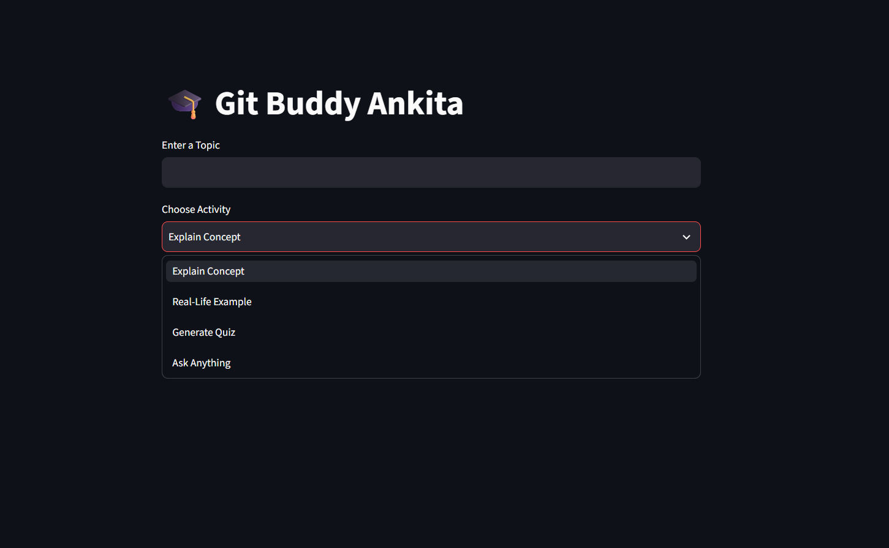
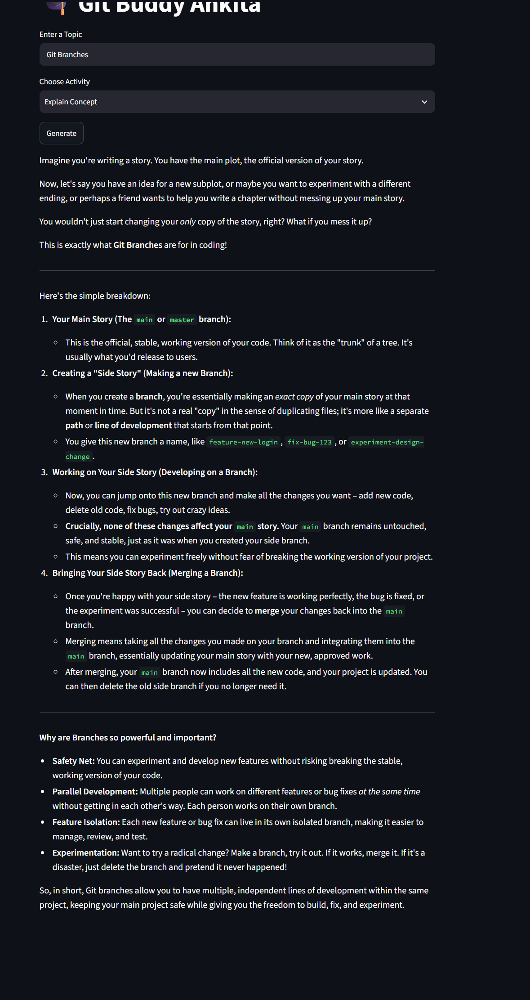
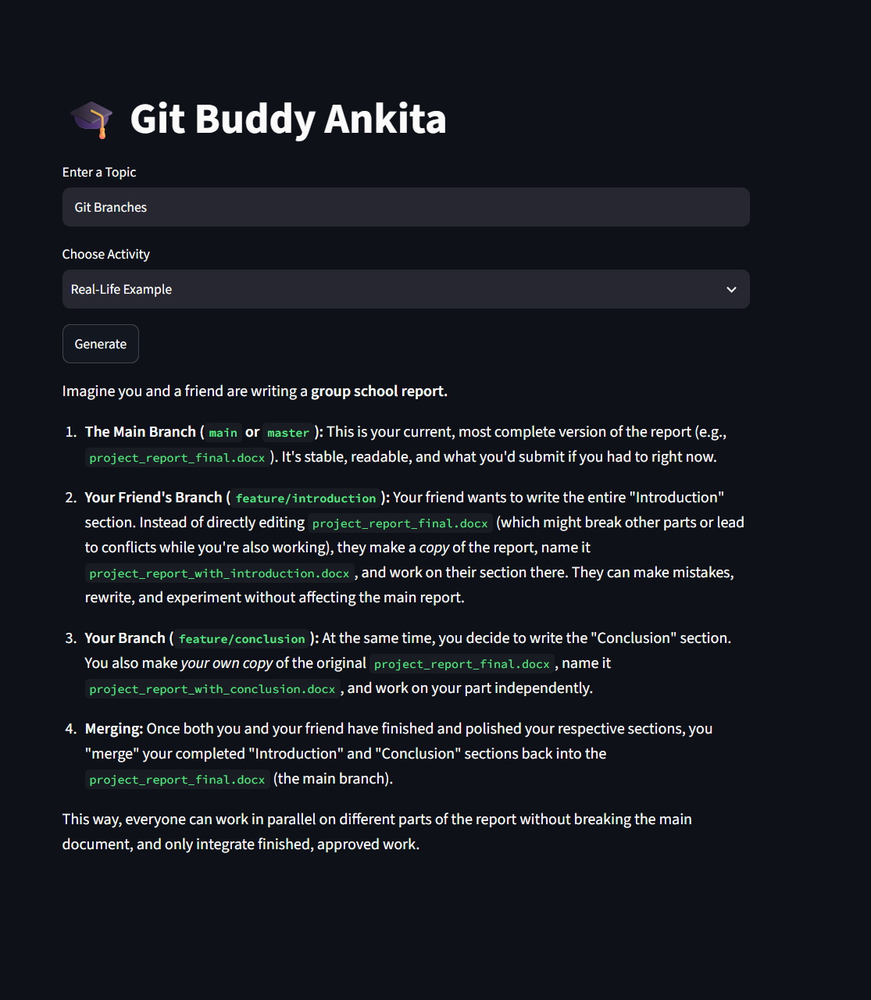

# 🎓 Git Buddy Ankita – AI Learning Assistant

An AI-powered learning assistant that helps beginners understand Git & GitHub Basics through simple explanations, real-life examples, interactive quizzes, and personalized responses.

## 🚀 Live Demo
🌐 https://gitbuddyai-mt2e6lcmbz75vnsnpzwuxw.streamlit.app/

## 📂 GitHub Repository
🔗 https://github.com/ankita06nandy/gitbuddy_ai

## ✨ Features

- 📖 Explain Git & GitHub concepts in simple language
- 💡 Generate real-life examples
- 📝 Create interactive quizzes
- 🤖 Ask Git & GitHub related questions using Gemini AI
- 🌐 Simple and user-friendly Streamlit interface

## 🛠️ Tech Stack

- Python
- Streamlit
- Google Gemini API
- Git
- GitHub

## ▶️ Run Locally

### Clone the repository

```bash
git clone https://github.com/ankita06nandy/gitbuddy_ai.git
```

### Install dependencies

```bash
pip install -r requirements.txt
```

### Add your Gemini API key

Create a Streamlit secret named:

```toml
GEMINI_API_KEY = "YOUR_API_KEY"
```

### Run the app

```bash
streamlit run app.py
```

## 📸 Project Preview

### 🏠 Home Page


### 📖 Explain Concept


### 💡 Real-Life Example


### 📝 Quiz Generator


## 📚 Project Objective

The objective of this project is to help beginners learn Git & GitHub Basics through an AI-powered tutor that provides simple explanations, practical examples, quizzes, and interactive learning.

## 🔮 Future Improvements

- Add voice-based interaction.
- Track user learning progress.
- Support more programming topics.
- Add user authentication and personalized learning.

## 👩‍💻 Author

**Ankita Nandy**

B.Tech CSE Student | AI & Software Engineering Enthusiast
